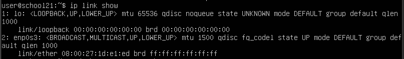
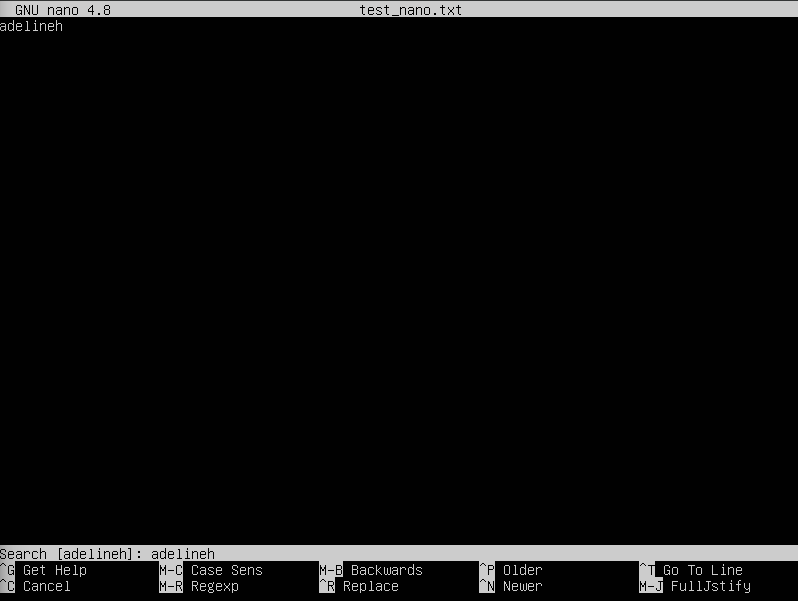
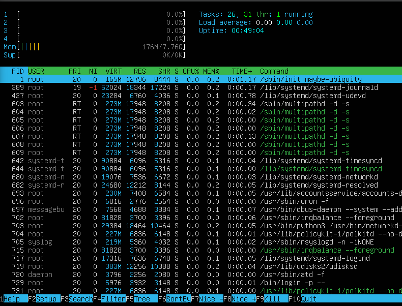

## Part 1. Установка ОС
- Выполнена установка Ubuntu 20.04 Server LTS без графического интерфейса, используя программу виртуализации VirtualBox.

    
<figcaption align="center">Рис. 1, версия операионной системы</figcaption>

## Part 2. Создание пользователя

- Добавлен новый пользователь с именем *adelineh* с помощью команды `sudo useradd -m -G adm adlineh`.

    
<figcaption align="center">Рис. 2, вывод команды <code>cat /etc/passwd</code></figcaption>

## Part 3. Настройка сети ОС

- Для изменения названия машины на user-1 была применена команда `sudo hostnamectl set-hostname user-1`
- Временная зона была изменена с помощью команды `sudo timedatectl set-timezone Europe/Moscow`
- Далее выведены названия сетевых интерфейсов - `ip link show`. Интерфейс *lo* - это loopback интерфейс, используемый для внутренних сетевых коммуникаций в системе.

    
<figcaption align="center">Рис. 3, вывод названий сетевых интерфейсов</figcaption>

- Получение IP адреса от DHCP было произведено с помощью `sudo dhclient -v`. DHCP (Dynamic Host Configuration Protocol) - протокол динамической настройки хоста, предназначен для автоматического получения сетевой конфигурации. 

    
<figcaption align="center">Рис. 4, полученные от DHCP сервера данные</figcaption>

- Определение внешнего и внутреннего IP - `ip route show`. Внешний - 10.0.2.2, внутренний - 10.0.2.15.

    
<figcaption align="center">Рис. 5, вывод внешнего и внутреннего IP</figcaption>

- Для того чтобы сделать изменения постоянными, следует внести их в конфигурационные файлы сетевого интерфейса системы, используя `sudo nano /etc/netplan/01-netcfg.yaml`.

    
<figcaption align="center">Рис. 6, изменение IP, шлюза и DNS сервера на статичные</figcaption>

- Перезагрузка виртуальной машины производится с помощью команды `sudo reboot`. После этого проверяется, что IP, шлюз и DNS сервер соответствуют заданным ранее.

    
<figcaption align="center">Рис. 7, измененные настройки после перезагрузки</figcaption>

- DDoS атака на ya.ru и 1.1.1.1 с использованием команды `ping -c 4 ya.ru` и `ping -c 4 1.1.1.1` соответственно, была успешно проведена.\

    
<figcaption align="center">Рис. 8, результат выполнения команды ping</figcaption>

## Part 4. Обновление ОС

- Для обновления списка пакетов используется команда `sudo apt update`, для обновления установленных пакетов `sudo apt upgrade -y`. После этого еще раз запускается команда `sudo apt update`. 

    
    <figcaption align="center">Рис. 9, сообщение о том, что все пакеты обновлены до последней версии</figcaption>

## Part 5. Использование команды sudo

- Команда `sudo` (SuperUser DO) предоставляет обычному пользователю возможность запуска команд от имени суперпользователя (root). `sudo` требует ввода собственного пароля пользователя.
- Для добавления пользователя в группу *sudo* вводится команда `sudo usermod -aG sudo adelineh`.
- Чтобы сменить имя хоста используется `sudo hostnamectl set-hostname user-2`.

    
    <figcaption align="center">Рис. 10, новое имя хоста, измененное от имени пользователя <em>adelineh</em></figcaption>

## Part 6. Установка и настройка службы времени

- Включение автоматической синхронизации времени делается через `sudo timedatectl set-ntp true`.

    
    <figcaption align="center">Рис. 11, вывод текущего времени и дополнительной информации о состоянии системных часов</figcaption>

## Part 7. Установка и использование текстовых редакторов

### VIM
- Для создания файла используется `vim test_vim.txt`.
- Cохранение изменений происходит через нажатие кнопки *Esc*, далее ввода `:wq` и нажатия *Enter*. 

    
    <figcaption align="center">Рис. 12, выход из VIM с сохранением изменений</figcaption>

- Выход без сохранения - аналогично, однако используется команда `:q!`.

    
    <figcaption align="center">Рис. 13, выход из VIM без сохранения изменений</figcaption>

- Поиск по файлу - используется `:/adelineh`.

    
    <figcaption align="center">Рис. 14, поиск по файлу в VIM</figcaption>

- Поиск и замена - `:%s/adelineh/bdelineh/g`.

    
    <figcaption align="center">Рис. 15, замена слова в файле в VIM</figcaption>

### NANO
- Для создания файла используется `nano test_nano.txt`.
- Cохранение изменений происходит через нажатие кнопки комбинации клавиш *Ctrl + O, Enter*, для выхода *Ctrl + X* 

    
    <figcaption align="center">Рис. 16, выход из NANO с сохранением изменений</figcaption>

- Выход без сохранения - используется комбинация клавиш *Ctrl + X*, затем *N*.

    
    <figcaption align="center">Рис. 17, выход из NANO без сохранения изменений</figcaption>

- Поиск по файлу - комбинация клавиш *Ctrl + W* и вводится необходимое слово.

    
    <figcaption align="center">Рис. 18, поиск по файлу в NANO</figcaption>

- Поиск и замена - нажимается комбинация *Ctrl + \\*, затем вводится искомое слово, нажимается *Enter*, вводится новое слово и снова нажимается *Enter*. После этого подтверждается замена с помощью нажатия *A*.

    
    <figcaption align="center">Рис. 19, замена слова в файле в NANO</figcaption>

### MCEDIT
- Для создания файла используется `mcedit test_mcedit.txt`.
- Cохранение изменений происходит через нажатие кнопки *F2*, и нажатия *Enter*. Выход из редактора происходит через кнопку *F10*. 

    
    <figcaption align="center">Рис. 20, выход из MCEDIT с сохранением изменений</figcaption>

- Выход без сохранения - необходимо нажать *F10*, после этого отказаться от сохранения данных, выбрав "No". 

    
    <figcaption align="center">Рис. 21, выход из MCEDIT без сохранения изменений</figcaption>

- Поиск по файлу - используется клавиша *F7*, затем вводится слово.

    
    <figcaption align="center">Рис. 22, поиск по файлу в MCEDIT</figcaption>

- Поиск и замена - нажимается клавиша *F4*, в строку "Enter search string:" вводится исходное слово, далее выбирается "Enter replacement string:" и вводится новое слово. После этого подтверждается выбор.

    
    <figcaption align="center">Рис. 23, замена слова в файле в MCEDIT</figcaption>

    
    <figcaption align="center">Рис. 24, окно подтверждения замены слова в файле в MCEDIT</figcaption>

## Part 8. Установка и базовая настройка сервиса SSHD

- Для установки используется команда `sudo apt install openssh-server`.
- Команда `sudo systemctl enable ssh` включает службу SSH в автозагрузку.
- Порт SSH сервера необходимо изменить в конфигурационном файле `sudo nano /etc/ssh/sshd_config`, затем перезапустить службу `sudo systemctl restart ssh`.
- Выполнение `ps -aux | grep sshd` отображает все процессы, связанные с sshd. Флаги:\
    `-a` - показывает процессы всех пользователей.\
    `-u` - отображает пользователя запустившего процесс.\
    `-x` - показывает процессы не связанные с терминалом.\
    `| grep sshd` - фильтрует вывод.

    
    <figcaption align="center">Рис. 25, результат выполнения команды <code>ps -aux | grep sshd</code></figcaption>

- Перезагрузка системы осуществляется с помощью `sudo reboot`.
- Так как изначально команда `netstat` не установлена ее необходимо установить - `sudo apt install net-tools`. После этого вводится `netstat -tan`. Ее флаги:\
    `-t` - показывает только TCP соединения.
    `-a` - отображает все соединения я прослушивающие порты.
    `-n` - выводит адреса и порты в числовом формате.

    
    <figcaption align="center">Рис. 26, результат выполнения команды <code>netstat -tan</code></figcaption>

## Part 9. Установка и использование утилит top, htop

- На основе данных, предоставленных командой `top` можно сделать вывод о том, что на момент снятия данных:\
uptime - 6 минут.\
Количество авторизованых пользователей - 1.\
Общая загрузка системы - 0.08 за 1 минуту, 0.19 за 5 минут и 0.13 за 15 минут.\
Общее количество процессов - 121.\
Загрузка CPU - 0.0 User Space, 0.0 System Space, 0.0 Nice, 100.0 Idle, 0.0 I/O Wait, 0.0 Hardware Interrupts, 0.0 Software Interrupts, 0.0 Steal Time.\
Загрузка памяти - всего 7935.5 МБ, из них свободно 7293.7 и используется 176.8, 475.0 оперативной памяти используется под буферы и кэш. В системе выделено 0 мегабайт подкачки, 0 свободны, 0 используются, а доступно для использования 7524 мегабайт оперативной памяти.\
PID процесса, занимающего больше всего памяти - 1, systemd, использует 0.2 %MEM.\
PID процесса, занимающего больше всего CPU - 1457, top, занимает 0.3% CPU.

    
    <figcaption align="center">Рис. 27, результат выполнения команды <code>top</code></figcaption>

- Запуск htop осуществляется с помощью `htop`.\
Чтобы отсортировать по PID, %CPU, %MEM, TIME необходимо нажать на *F6* и выбрать соответствующий пункт.

    
    <figcaption align="center">Рис. 28, результат выполнения команды <code>htop</code>, отсортированный по <code>PID</code></figcaption>

    
    <figcaption align="center">Рис. 29, результат выполнения команды <code>htop</code>, отсортированный по <code>%CPU</code></figcaption>

    
    <figcaption align="center">Рис. 30, результат выполнения команды <code>htop</code>, отсортированный по <code>%MEM</code></figcaption>

    
    <figcaption align="center">Рис. 31, результат выполнения команды <code>htop</code>, отсортированный по <code>TIME</code></figcaption>

Чтобы отфильтровать для процесса `sshd` необходимо нажать клавишу *F4* и ввести `sshd`.

    
    <figcaption align="center">Рис. 32, результат выполнения команды <code>htop</code>, отфильтрованный для процесса <code>sshd</code></figcaption>

Чтобы найти процесс `syslog` необходимо нажать *F4* и ввести `syslog`.

    
    <figcaption align="center">Рис. 33, результат выполнения команды <code>htop</code>, с найденным процессом <code>syslog</code></figcaption>

Чтобы добавить вывод `hostname, clock, uptime` необходимо нажать *F2*, выбрать один из пунктов в крайнем правом окне и перетащить его в активные. Это следует повторить с каждым пунктом.

    
    <figcaption align="center">Рис. 34, результат выполнения команды <code>htop</code>, с добавленными выводами <code>hostname, clock, uptime</code></figcaption>

## Part 10. Использование утилиты fdisk

- После использования команды `fdisk -l` появляется информация о диске:\
Название - /dev/sda/.\
Размер - 25 GiB.\
Количество секторов - 52428800.\
Размер swap - 0.

    
    <figcaption align="center">Рис. 35, информация о диске</figcaption>

## Part 11. Использование утилиты df

- Команда `df /` выдает следующие значения: Размер раздела - 11,758,760 килобайт, из которых 2,675,932 килобайта занято, и 8,463,720 килобайт свободно, что составляет 25% от общего размера.

    
    <figcaption align="center">Рис. 36, вывод информации о дисковом пространстве</figcaption>

- Команда `df -Th /` выдает следующие значения: Размер раздела - 12 гигабайт, из них 2.6 занято, а 8.1 свободно. Общий процент использования так же 25%, что аналогично предыдущему выводу. Флаг `-T` добавляет в вывод тип файловой системы, в данном случае это `ext4`, а флаг `-h` приводит все в удобочитаемый формат.

    
    <figcaption align="center">Рис. 37, вывод информации о дисковом пространстве в удобочитаемом формате</figcaption>

## Part 12. Использование утилиты du

- Команда `du` отображает использование дискового пространства файлами и директориями. Флаг `-s` отображает только общий размер для каждой категории, флаг `-h` приводит в удобочитаемый вид. Таким образом получается команда `du -sh /<название папки>`, где `<название папки>` - `/home`, `/var`, `/var/log`.

    
    <figcaption align="center">Рис. 38, вывод информации размере директорий в обычном и человекочитаемом виде</figcaption>

- Для вывода всего содержимого папки `/var/log` используется команда `du -h /var/log/*`

    
    <figcaption align="center">Рис. 39, вывод информации о размере каждого элемента в директории <code>/var/log/</code></figcaption>

## Part 13. Установка и использование утилиты ncdu

- Для установки утилиты *ncdu* используется команда `sudo apt install ncdu`.
- После установки вводятся команды `ncdu /<название папки>`, где `<название папки>` - `/home`, `/var`, `/var/log`.

    
    <figcaption align="center">Рис. 40, вывод информации о размере директории <code>/home</code> с помощью утилиты <code>ncdu</code></figcaption>

    
    <figcaption align="center">Рис. 41, вывод информации о размере директории <code>/var</code> с помощью утилиты <code>ncdu</code></figcaption>

    
    <figcaption align="center">Рис. 42, вывод информации о размере директории <code>/var/log</code> с помощью утилиты <code>ncdu</code></figcaption>

## Part 14. Работа с системными журналами

- Для работы с системными журналами необходимо открыть 3 файла через `nano <название файла>`, где `<название файла>` - `/var/log/dmesg`, `/var/log/syslog`, `/var/log/auth.log`.

    
    <figcaption align="center">Рис. 43, вывод последних строк файла <code>/var/log/dmesg</code> </figcaption>

    
    <figcaption align="center">Рис. 44, вывод последних строк файла <code>/var/log/syslog</code> </figcaption>

- В файле `/var/log/auth.log` хранятся записи об авторизации. На их основе можно сделать вывод, что время последней авторизации - 8:23:45, имя пользователя - user, метод входа в систему LOGIN(uid=0).

    
    <figcaption align="center">Рис. 45, вывод последних строк файла <code>/var/log/auth.log</code> </figcaption>

- После этого необходимо перезапустить службу *SSHd* с помощью `sudo systemctl restart sshd`. Затем, ищутся сообщения о рестарте `grep 'sshd' <название файла>`, где `<название файла>` - `/var/log/dmesg`, `/var/log/syslog`, `/var/log/auth.log`.

    
    <figcaption align="center">Рис. 46, вывод результатов поиска сообщения о рестарте службы <it>SSHd</it></figcaption>

## Part 15. Использование планировщика заданий CRON

- Для редактирования планировщика задания используется команда `crontab -e`. Далее следует внести строку `*/2 * * * * /usr/bin/uptime` в конец файла.

    
    <figcaption align="center">Рис. 47, текущие задания CRON</figcaption>

- Для поиска отчета в системных журналах `grep CRON /var/log/syslog`.

    
    <figcaption align="center">Рис. 48, 2 выполненных задания</figcaption>

- Для удаления всех задач можно использовать `crontab -r`. Затем, для просмотра `crontab -l`.

    
    <figcaption align="center">Рис. 49, текущие задания CRON</figcaption>

